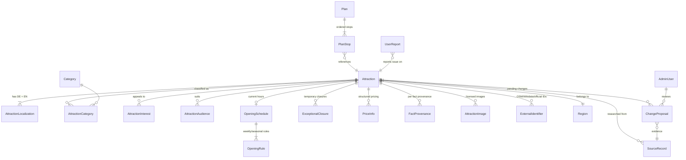

# Domain model

Status: **architectural decision**. The database is the central product asset ([ADR-003](../adr/ADR-003-master-attraction-database.md)).

## Design principles

1. **Stable editorial data is separated from volatile operational data.** `Attraction` holds slow-changing identity and classification; volatile facts (hours, prices, closures, weather) live in dedicated entities with their own provenance and refresh cadence.
2. **Every important filtering dimension is a normalized enum, relation, or dedicated field** — never a free-form tag ([../data/tag-and-filter-taxonomy.md](../data/tag-and-filter-taxonomy.md)). Editorial tags exist additionally for search/SEO only.
3. **Every externally sourced fact carries provenance** (source, type, checked timestamps, confidence — [../data/provenance-and-licensing.md](../data/provenance-and-licensing.md)).
4. **Unknown ≠ no.** Nullable/`UNKNOWN` values are first-class; filters treat them per the must/nice rule ([../ux/filter-and-search-behaviour.md](../ux/filter-and-search-behaviour.md#general-semantics-decision)).
5. Localizable content lives in per-locale child rows, never in duplicated columns ([i18n.md](i18n.md)).

## Core entity relationship diagram

## Entities

### Attraction (aggregate root — stable editorial data)

| Field | Type | Notes |
|---|---|---|
| `id` | UUID | Canonical identity; **stable forever**; referenced by plans, favorites, AI layer |
| `status` | enum `DRAFT / IN_REVIEW / PUBLISHED / UNPUBLISHED / ARCHIVED` | Publication state (REQ-DATA-06); only `PUBLISHED` is public |
| `location` | point (PostGIS) | WGS84 coordinates |
| `countryCode` | enum `DE / CH / AT` | Drives currency/holiday/transit context |
| `municipality` | string | Descriptive, not scope-defining |
| `regionCode` | FK → Region | Product region ([../product/geographic-scope.md](../product/geographic-scope.md#product-regions)) |
| `shorelineDistanceM` | int, computed | From shoreline geometry; recomputed when geometry updates |
| `scopeException` / `scopeExceptionReason` | bool / text | Inclusion rule 3; reason mandatory when true (ADR-001) |
| `indoorOutdoor` | enum `INDOOR / OUTDOOR / MIXED` | |
| `rainSuitability`, `heatSuitability` | ordinal enum `POOR / OK / GOOD / EXCELLENT` | |
| `seasons` | enum set `SPRING / SUMMER / AUTUMN / WINTER / ALL_YEAR` | Seasonality |
| `typicalDurationMin` / `Max` | int minutes | Typical visit duration band |
| `priceLevel` | enum `FREE / LOW / MEDIUM / HIGH / PREMIUM` | Coarse classification for filtering |
| `bookingRequirement` | enum `NONE / RECOMMENDED / REQUIRED` | |
| `bookingUrl`, `officialWebsite` | URL | Official links (REQ-DISC-11) |
| `childAgeBands` | enum set `0-2 / 3-5 / 6-9 / 10-13 / 14+` | Suitability, must-filter |
| `foodOnSite`, `cafeOnSite`, `picnicAllowed`, `toilets` | bool? | `null` = unknown |
| `strollerSuitable` | enum `YES / PARTIAL / NO / UNKNOWN` | |
| `wheelchairAccess` | enum `FULL / PARTIAL / NONE / UNKNOWN` | Verified only; never inferred |
| `wheelchairToilet` | bool? | |
| `dogPolicy` | enum `ALLOWED / LEASHED / NO / UNKNOWN` | |
| `visitorLanguages` | enum set (`DE/EN/FR/IT/…`) | Languages of signage/tours/audio guides |
| `transportModes` | enum set `WALK / BICYCLE / PUBLIC_TRANSPORT / CAR` | Realistic arrival modes |
| `nearestStopName`, `nearestStopDistanceM` | string?, int? | Static PT info (no live routing in MVP) |
| `parkingInfo` | enum `ON_SITE / NEARBY / DIFFICULT / NONE` + note | |
| `bicycleAccess` | bool? + note | Bike parking / path access |
| `editorialImportance` | decimal 0..1 | Relevance-score input, editor-set |
| `verificationState` | enum `UNVERIFIED / PARTIALLY_VERIFIED / VERIFIED` | Roll-up of fact provenance |
| `lastVerifiedAt` | timestamp | Roll-up: oldest critical-fact check |
| `confidence` | enum `LOW / MEDIUM / HIGH` | Roll-up |
| `dataLicence` | FK → Licence | Licence governing stored factual data |
| `createdAt`, `updatedAt` | timestamps | |

**Invariants:** published ⇒ has both localizations, coordinates, region, category, at least one verified critical fact set (name, location, hours-or-explicitly-unknown), and passes the scope rule; `scopeException=true` ⇒ `scopeExceptionReason` non-empty.

### AttractionLocalization
`attractionId + locale (de|en)` unique · `name` · `slug` (unique per locale) · `summary` (original text, never copied — REQ-DATA-05) · `description` · `practicalNotes` (guest cards, quirks) · `translationState` enum `SOURCE / TRANSLATED / NEEDS_REVIEW / STALE` ([i18n.md](i18n.md#translation-invalidation)).

### Category, Interest, Audience (+ join tables)
Controlled vocabularies with localized labels, defined in [../data/tag-and-filter-taxonomy.md](../data/tag-and-filter-taxonomy.md). Two-level categories (primary → sub). Vocabulary changes are migrations-with-review, not free editor input.

### EditorialTag (+ join)
Free-form, localized, search/SEO only. **Never used in filter logic** (guarded by lint rule in the domain package).

### OpeningSchedule / OpeningRule (volatile) {#opening-hours}
- `OpeningSchedule`: `attractionId`, `validFrom`, `validTo` (seasonal windows), `hoursUnknown` flag.
- `OpeningRule`: schedule FK, `dayOfWeek` set, `opens`, `closes`, `appliesOnPublicHolidays` enum `AS_WEEKDAY / CLOSED / SPECIAL`, optional `holidayCalendar` ref (`DE-BW`, `CH-TG`, `CH-SH`, `AT-VBG` — country/canton-aware, essential for Sunday/holiday correctness across three countries).
- Evaluation (pure domain function): `openStateAt(attraction, timestamp, holidayCalendars) → OPEN / CLOSED / UNKNOWN`, used by the "open now / open on date" filters and plan conflict detection. Exceptional closures override rules.

### ExceptionalClosure (volatile)
`attractionId`, `dateRange`, `reason` (localized short text), `source`, provenance fields. Daily refresh where a source exists.

### PriceInfo (volatile, optional structured pricing)
`attractionId`, `audience` (adult/child/family/…), `amount`, `currency (EUR/CHF)`, `validFrom/To`, `note`, provenance fields. `priceLevel` on Attraction remains the filtering field; `PriceInfo` powers the detail page.

### SourceRecord
Raw research/refresh evidence: `id`, `attractionId?`, `sourceUrl`, `sourceType` enum `OFFICIAL_WEBSITE / TOURISM_ORG / PUBLIC_FEED / OSM / WIKIDATA / WIKIPEDIA / OTHER`, `retrievedAt`, `contentHash`, `rawPayload` (JSONB), `licenceNote`. Immutable once written.

### FactProvenance (per volatile fact — REQ-DATA-02)
`attractionId`, `factKey` (e.g. `opening_hours`, `price`, `closure`, `wheelchair_access`), `sourceRecordId`, `sourceType`, `lastCheckedAt`, `nextRefreshAt`, `confidence` enum, `updateStatus` enum `FRESH / DUE / STALE / SOURCE_UNAVAILABLE / IN_REVIEW`, `detectedChange` (JSONB, optional), `reviewerDecision` (optional: who, when, approve/reject). See [../data/refresh-and-review-pipeline.md](../data/refresh-and-review-pipeline.md).

### ChangeProposal (review queue)
`id`, `attractionId`, `factKey`, `currentValue`, `proposedValue` (JSONB), `sourceRecordId`, `confidence`, `origin` enum `SCHEDULED_REFRESH / RESEARCH_IMPORT / USER_REPORT`, `status` enum `PENDING / APPROVED / REJECTED / SUPERSEDED`, `reviewedBy?`, `reviewedAt?`, `reviewNote?`.

### ExternalIdentifier
`attractionId`, `system` enum `OSM / WIKIDATA / GOOGLE_PLACE_ID*/ OFFICIAL`, `externalId`, unique per (system, externalId) — duplicate-detection backbone (REQ-DATA-04). *Google Place IDs only if the licensing analysis permits storage — [../data/data-source-policy.md](../data/data-source-policy.md#google-places).

### AttractionImage
`attractionId`, `storagePath`, `licence` (SPDX-like enum + text), `attributionText` (rendered where required), `sourceUrl`, `sortOrder`. No image without licence + attribution ([../data/provenance-and-licensing.md](../data/provenance-and-licensing.md#images)).

### Region
`code` (PK, e.g. `UNTERSEE_NORD`), localized names, `polygon` (PostGIS), `sortOrder`. Seed data from `data/geo/`.

### Plan / PlanStop (user data, server-side only when shared)
- `Plan`: `id`, `shareToken` (unique, ≥128-bit), `date?`, `startPoint` (rounded point + label), `locale`, `createdAt`, `lastAccessedAt` (retention).
- `PlanStop`: `planId`, `attractionId`, `sortIndex`, `plannedDurationMin?` (override of typical duration).
- Local (unshared) plans use the same shape in IndexedDB. Validation logic (conflicts, totals) is a pure domain function shared by client and server ([../planning/manual-planner.md](../planning/manual-planner.md)).

### UserReport
`id`, `attractionId`, `category` enum, `message?`, `locale`, `createdAt`, `status` enum `NEW / TRIAGED / RESOLVED / DISMISSED`. No personal data fields. Feeds ChangeProposal on triage.

### AdminUser
`id`, `email`, `passwordHash` (argon2id) or SSO subject, `role` enum `EDITOR / REVIEWER / ADMIN`, `totpSecret?`. See [auth-and-anonymous-usage.md](auth-and-anonymous-usage.md#admin-authentication).

### Licence
Registry of content/data licences: `id`, `spdxOrName`, `attributionRequired`, `commercialUseAllowed`, `shareAlike`, `notes`. Referenced by attractions, images, source records.

## Duplicate detection (REQ-DATA-04)

Candidate pair score (pure domain function, thresholds configurable):

| Signal | Rule |
|---|---|
| External identifier | Same `(system, externalId)` ⇒ certain duplicate |
| Official URL | Normalized host+path match ⇒ strong |
| Coordinates | < 100 m apart ⇒ strong; < 300 m ⇒ weak |
| Normalized name | Lowercased, diacritics-folded, legal-suffix-stripped trigram similarity > 0.85 ⇒ strong; > 0.7 ⇒ weak |

≥ 1 certain or ≥ 2 strong ⇒ auto-flag as duplicate pair for merge review; 1 strong (+ optional weak) ⇒ review-queue candidate. Merging keeps the older `id` and records the merged ID as an alias (redirects, stable references). Details: [../quality/data-quality-strategy.md](../quality/data-quality-strategy.md#duplicate-detection).

## What is deliberately NOT in the model (MVP)

- User accounts for tourists (phase 1.5+; ADR-004).
- Events, live transit journeys, reviews, restaurant entities ([../product/later-phases.md](../product/later-phases.md)).
- Weather storage per attraction — weather is fetched per lake sub-area and cached, not persisted per attraction ([../data/refresh-and-review-pipeline.md](../data/refresh-and-review-pipeline.md#weather)).
