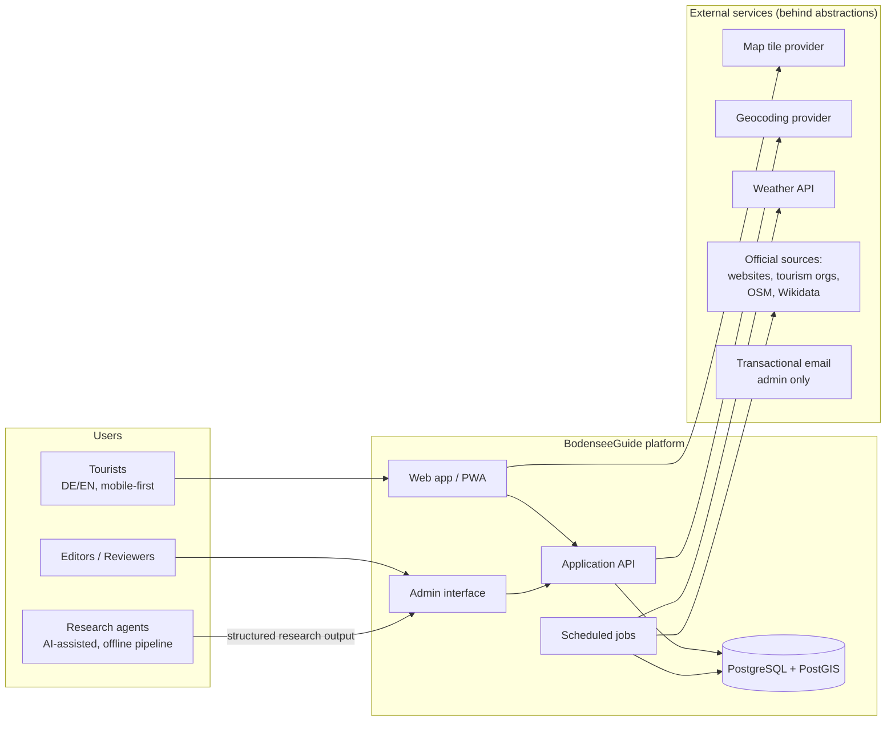
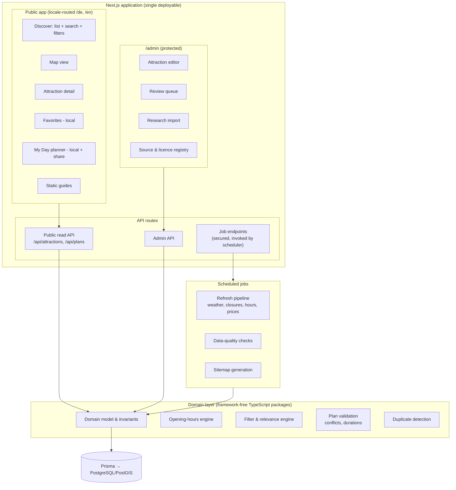
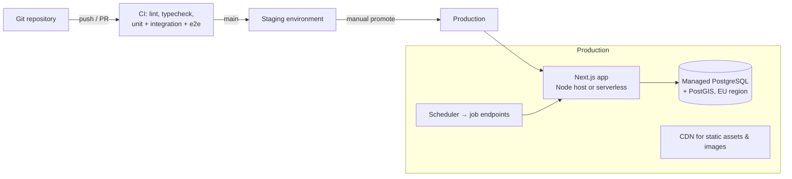

# System architecture

Status: **architectural decision** (greenfield — repository was empty; stack decided in [ADR-009](../adr/ADR-009-technology-stack.md)).

## System context



Key boundaries:

- **Tourists** touch only the public web app; no accounts (ADR-004).
- **Research agents** never write to the production database directly; they produce structured output validated against [../data/research-output-schema.md](../data/research-output-schema.md) and imported through the admin/import pipeline.
- **External providers** are consumed through interfaces so they can be replaced ([ADR-005](../adr/ADR-005-map-provider-abstraction.md), [external-services.md](external-services.md)).

## Main application components



### Component responsibilities

| Component | Responsibility | Spec |
|---|---|---|
| Public app | Discovery, detail, favorites, plans, guides; PWA shell | [../ux/](../ux/information-architecture.md) |
| Domain layer | Pure TypeScript: entities, opening-hours evaluation, filter semantics, plan validation, dedup scoring. No framework or I/O imports — unit-testable in isolation, reusable by the phase-2 planner | [domain-model.md](domain-model.md) |
| Public API | Read-only attraction queries (filter/search/bbox), plan share create/read. Rate-limited | [api-contracts.md](api-contracts.md) |
| Admin | Attraction CRUD, review queue, research import, source registry. Session-authenticated, role-based | [auth-and-anonymous-usage.md](auth-and-anonymous-usage.md#admin-authentication) |
| Scheduled jobs | Freshness refresh, data-quality sweeps, sitemaps. Idempotent, observable, safe on source failure | [../data/refresh-and-review-pipeline.md](../data/refresh-and-review-pipeline.md) |
| Database | Single PostgreSQL with PostGIS; source of truth for content; user data limited to shared plans and reports | [database-schema.md](database-schema.md) |

### Architectural style (decision)

A **modular monolith**: one Next.js deployable plus one Postgres instance, with the domain layer as separately testable workspace packages (`packages/domain`, `packages/db`). No microservices, no message broker, no separate API service — nothing in the MVP's scale (thousands of attractions, seasonal tourist traffic) justifies them. The seams that matter later (domain layer free of framework code; jobs invoked via HTTP endpoints so a dedicated worker can replace them; provider interfaces) are cheap now and preserve every planned extension (deterministic planner = new domain package; AI assistant = new API route + external LLM).

## Repository layout (proposed)

```
/
├── apps/web/                  # Next.js app (public + admin + API routes)
├── packages/domain/           # Pure domain logic (entities, engines)
├── packages/db/               # Prisma schema, client, migrations, seeds
├── packages/config/           # Shared tsconfig/eslint
├── data/
│   ├── geo/                   # Shoreline + region polygons (GeoJSON, versioned)
│   └── research/              # Raw research output (JSON, per sector) — not deployed
├── docs/                      # This documentation
└── .github/workflows/         # CI
```

pnpm workspaces + Turborepo-optional (start with plain pnpm; add task caching only when build times hurt).

## Environment variables

Single source of truth; mirrored in `.env.example` once scaffolding exists (ticket LAKE-001).

| Variable | Purpose |
|---|---|
| `DATABASE_URL` | Postgres connection |
| `ADMIN_AUTH_SECRET` | Session signing for admin auth |
| `ADMIN_EMAIL_ENDPOINT`, `ADMIN_EMAIL_API_KEY`, `ADMIN_EMAIL_FROM` | EU transactional email adapter for admin password resets |
| `ADMIN_EMAIL`, `ADMIN_INITIAL_PASSWORD`, `ADMIN_ROLE` | Initial admin seed (`ADMIN_INITIAL_PASSWORD` is never stored in source) |
| `JOB_TRIGGER_SECRET` | Bearer secret for scheduled-job endpoints |
| `MAP_TILE_URL`, `MAP_TILE_API_KEY` | Tile provider (abstracted) |
| `GEOCODER_URL`, `GEOCODER_API_KEY` | Geocoding provider (abstracted) |
| `WEATHER_API_URL`, `WEATHER_API_KEY` | Weather provider |
| `ANALYTICS_DOMAIN` | Privacy-friendly analytics host |
| `SCOPE_SHORELINE_BAND_KM` | Inclusion-rule threshold (default 5) |
| `PUBLIC_BASE_URL` | Canonical URL for sitemaps/share links |

Secrets management: [../quality/security-and-privacy.md](../quality/security-and-privacy.md#secret-management).

## Deployment overview



Hosting requirements (provider-agnostic; concrete recommendation in [../operations/deployment.md](../operations/deployment.md)): EU data residency (GDPR), managed Postgres with PostGIS, cron/scheduler support, preview deployments for PRs.

## Cross-cutting decisions

- **Rendering:** attraction list/detail pages are server-rendered with ISR-style caching (SEO REQ-SEO-01 + freshness); favorites/plan screens are client-rendered (local data).
- **State:** filter state in URL; local user data (favorites/plan) in IndexedDB; no global client state library until proven necessary.
- **Caching:** public API responses cacheable (60 s, stale-while-revalidate) except open-now computations which are computed per request from cached hours.
- **API style:** JSON REST via Next.js route handlers with zod-validated contracts ([api-contracts.md](api-contracts.md)). No GraphQL — one first-party consumer.
