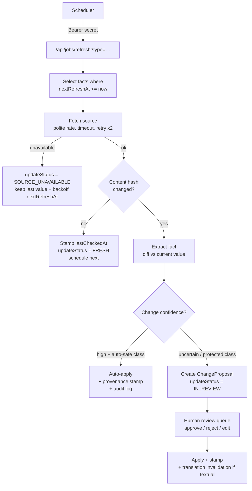

# Refresh and review pipeline

Status: **architectural decision** ([ADR-006](../adr/ADR-006-periodic-data-refresh.md)): "live" information is refreshed **periodically**, never fetched per user request; uncertain changes go through human review.

## Freshness policy (decision; cadences configurable per source in the registry)

| Fact class | Cadence | Notes |
|---|---|---|
| Weather | Every 1–3 h | Per lake sub-area, cached; not stored per attraction |
| Temporary/exceptional closures | Daily, where a supported source exists | Sources: official sites/tourism feeds with detectable closure info |
| Events | Daily — **phase 1.5**, not MVP | |
| Opening hours | Weekly | Full re-extraction + diff |
| Admission prices | Monthly | |
| Seasonal information | Before each season (4×/year, scheduled 4 weeks ahead) | Season windows, seasonal hours switch |
| Public-transport schedules | On source-feed change (phase 1.5 GTFS) | MVP: static nearest-stop info, verified with hours cadence |
| Editorial descriptions & tags | Manual or event-driven (user reports, verification findings) | Never auto-changed |

Every volatile fact carries (REQ-DATA-02, `FactProvenance` in [../architecture/domain-model.md](../architecture/domain-model.md#factprovenance-per-volatile-fact--req-data-02)): source, source type, `lastCheckedAt`, `nextRefreshAt`, confidence, `updateStatus`, optional `detectedChange`, optional `reviewerDecision`.

## Scheduled refresh flow

### Auto-apply vs review (decision)

| Class | Handling |
|---|---|
| Auto-safe, high confidence | `lastCheckedAt` refresh with unchanged value; numeric price change ≤ 10 % from official source; closure *added* from official source (safety-biased: closing is low-risk, opening is not) |
| Always review | Opening-hours structure changes; price changes > 10 % or currency anomalies; closure *removal*; accessibility changes (any direction); anything `conflicting`; textual changes; scope-relevant changes (coordinates moved > 250 m) |

Rationale: wrong "open/accessible" harms users more than wrong "closed" — the pipeline is deliberately asymmetric.

### Weather {#weather}
Weather is ephemeral context, not a fact about attractions: fetched per sub-area (4 sample points: Konstanz, Friedrichshafen, Bregenz, Radolfzell), cached 1–3 h in a small `weather_cache` table/KV, used for "rainy day" hints and phase-2 planning inputs. Provider failure ⇒ hints hidden, nothing else degrades ([../architecture/external-services.md](../architecture/external-services.md#weather)).

## Review queue

Single queue (admin UI) fed by three origins (`ChangeProposal.origin`): scheduled refresh, research import, user reports. Ordered by impact (published attractions first, safety-relevant fields first). Reviewer sees: field, current → proposed, source snippet + URL, confidence, history. Decisions: approve / reject / edit-then-approve; every decision stamps `reviewerDecision` (audit trail). SLA target: safety-relevant proposals < 2 working days, others < 7 ([../operations/maintenance.md](../operations/maintenance.md#routine-cadence)).

### User reports {#user-reports}
Reports (REQ-REP-01) arrive as `UserReport` → triage (dedupe, spam check) → become ChangeProposals when plausible → same review path. Reporter gets a generic thank-you UI; no email loop (no PII collected).

## Staleness presentation (REQ-DATA-07)

`updateStatus` + policy age determine user-facing freshness:

| State | Badge on detail page |
|---|---|
| FRESH / within policy | "Verified {date}" (quiet) |
| DUE (≤ 2× policy age) | "Verified {date}" (quiet — grace period) |
| STALE (> 2× policy age) or SOURCE_UNAVAILABLE | Per-fact warning: "Opening hours last verified {date} — please check the official site" + prominent official link |
| Critical stale (hours > 4× policy in season) | Attraction excluded from "open now" results (unknown-hours handling, [../ux/filter-and-search-behaviour.md](../ux/filter-and-search-behaviour.md)) |

Degradation rule: external source outages **never** empty a page — last verified values stay, honestly labelled.

## Idempotency & operations

Jobs are idempotent (keyed on fact + `lastCheckedAt`); re-runs safe; each run writes a `job_run` summary (fetched/changed/auto-applied/queued/failed) exposed to monitoring ([../operations/observability.md](../operations/observability.md#job-monitoring)). Per-source politeness: ≥ 10 s between requests to one host, respect robots.txt, identify with a contact UA string.
