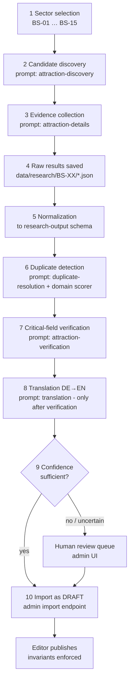

# Attraction research workflow

Status: **architectural decision** (pipeline, contracts), **recommendation** (batch sizes, tooling ergonomics).

A dedicated, **separate** workflow — research is *not* part of product implementation tickets, and this task's deliverable is the workflow itself, not the dataset. Research agents (AI-assisted, human-operated) produce structured output validated against [research-output-schema.md](research-output-schema.md); nothing enters the production database except through validated import + review.

## Pipeline overview

Steps map to the reusable prompts in [../research/prompts/](../research/prompts/attraction-discovery.md); every step's output retains **per-field provenance** (source URL, retrieval date, confidence).

## Step details

1. **Sector selection.** Work sector-by-sector using BS-01…BS-15 ([../product/geographic-scope.md](../product/geographic-scope.md#research-sectors)). One sector = one research batch = one output file set. Suggested order after the pilot: highest-tourism sectors first (BS-14, BS-15, BS-12, BS-11, BS-01…).
2. **Candidate discovery.** Sources: official tourism-org listings (priority 2), OSM Overpass extracts, Wikidata queries for the sector bbox. Output: candidate list with name, approximate coordinates, discovery source(s), suspected category, in-scope pre-check (5 km band). Explicitly *not* yet fact research.
3. **Evidence collection.** Per candidate, gather facts **with a source URL each** using the source priority ([data-source-policy.md](data-source-policy.md#source-priority-decision-binding-for-research--refresh)). Unsupported facts are prohibited — a field without evidence stays `null` with `status: "not_found"`.
4. **Raw persistence.** Everything lands in `data/research/{sector}/{candidate-slug}.json` (schema-conformant) committed to the repo — reviewable, diffable, replayable.
5. **Normalization.** Free-form findings map to taxonomy codes ([tag-and-filter-taxonomy.md](tag-and-filter-taxonomy.md)); unmappable signals go to `unmappedSignals` (governance input, never invented codes).
6. **Duplicate detection.** Deterministic scorer (coordinates, normalized names, official URLs, external IDs — [../architecture/domain-model.md](../architecture/domain-model.md#duplicate-detection-req-data-04)) against existing DB + current batch; ambiguous pairs → duplicate-resolution prompt → still ambiguous → human review.
7. **Verification.** Critical fields (existence, name, coordinates, opening hours, prices, closure status, accessibility claims) re-checked against **official** sources (priority 1–2 only). Each verified field gets `verification: {verifiedAt, sourceUrl, method}`. Accessibility facts: official statement required, otherwise `UNKNOWN` (persona P5 safety).
8. **Translation.** German → English **after** verification only (never translate unverified claims). Translation prompt enforces transcreation rules ([../architecture/i18n.md](../architecture/i18n.md#content-localization-rules-decision)).
9. **Review routing.** Records with any critical field `confidence < HIGH`, unresolved duplicates, scope exceptions, or `unmappedSignals` → human review queue with the evidence attached.
10. **Import & publish.** `POST /api/admin/import/research` validates against the JSON Schema, creates/updates `DRAFT` attractions + SourceRecords + FactProvenance. Publication stays a human editor action (REQ-DATA-06).

## Agent output requirements (binding)

- **Structured output only** — schema-conformant JSON per [research-output-schema.md](research-output-schema.md); prose reports are not accepted inputs.
- Every field value carries provenance; **no source URL ⇒ no fact**.
- No invented facts, no guessed hours, no inferred accessibility. "Not found" is a valid, expected answer.
- Editorial summaries: original German prose composed from the collected facts (no copied sentences), 40–80 words, neutral tone — see details prompt.

## Pilot procedure {#pilot-procedure}

Goal: validate schema, prompts, dedup, review UX, and effort-per-attraction **before** scaling. Explicitly **not** dataset production.

1. Sectors: **BS-01 (Konstanz), BS-14 (Meersburg), BS-06 (Stein am Rhein)** — three countries' contexts (DE city, DE shore town, CH historic town), rich official sources.
2. Volume: 8–12 candidates per sector (~30 total), spanning categories incl. at least one scope-exception candidate and one deliberate near-duplicate (e.g. "Burg Meersburg" vs "Altes Schloss Meersburg" naming).
3. Run the full pipeline steps 2–9; import into a **staging** database only.
4. Measure: minutes per verified attraction · % fields verified vs not_found · dedup precision/recall on seeded duplicates · review-queue rate · schema-validation failure count · translation quality spot-check (bilingual reviewer).
5. Exit criteria: schema unchanged for the last 10 records · dedup catches the seeded duplicate · < 20 % of records need schema-related rework · effort per attraction ≤ 45 min. Otherwise revise prompts/schema and rerun.
6. Outcomes feed: prompt revisions, schema v1.1, effort forecast for full-shoreline research (~15 sectors × 20–40 attractions).

Pilot execution is ticket LAKE-023 (workflow validation) — full production research is a separate ongoing operation outside the implementation backlog.

## Tooling (minimal by design)

MVP tooling = JSON Schema validation CLI (`pnpm research:validate data/research/BS-01/*.json`) + the admin import endpoint. No bespoke research platform; agents run in standard AI tooling with web access, humans paste/commit outputs. Build more only if pilot metrics demand it.
