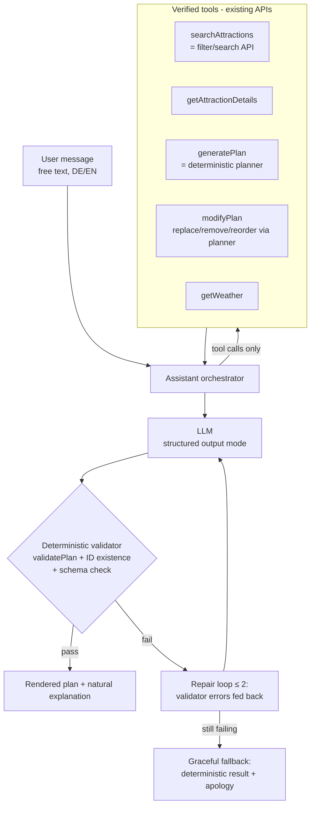

# AI travel assistant (phase 3)

Status: **planning-ready specification** — built only when Gate G2 is met ([../product/success-metrics.md](../product/success-metrics.md#g2--build-the-ai-travel-assistant-phase-3)), after the deterministic planner exists ([ADR-007](../adr/ADR-007-deterministic-before-llm.md)).

## Core principle

**The LLM is a conversational interface over verified tools — never a source of truth.** It cannot invent places, hours, prices, or routes. It receives verified structured candidates, refers to attractions only by stable IDs, returns structured output, and everything it proposes passes the deterministic validator before users see it as a valid plan.

## Architecture



## Tool interfaces {#tool-interfaces}

Tools are thin wrappers over existing contracts ([../architecture/api-contracts.md](../architecture/api-contracts.md)) — the AI layer consumes the same APIs as the UI:

| Tool | Wraps | Guarantee |
|---|---|---|
| `searchAttractions(filters)` | `GET /api/attractions` | Returns only published, verified records (id, name, key facts) |
| `getAttractionDetails(id)` | `GET /api/attractions/{id}` | Full verified facts incl. freshness |
| `generatePlan(request)` | `POST /api/planner/generate` | Feasible-by-construction drafts |
| `modifyPlan(planDraft, operation)` | Planner repair mode | Re-validates after every mutation |
| `getWeather(area, date)` | Weather cache | Cached forecast only |

The LLM's context contains **only tool results** as factual material; the system prompt forbids asserting any attraction fact not present in a tool result.

## Prompt boundaries

System prompt (versioned in repo, reviewed like code): role & tone (helpful local guide, both locales) · **hard prohibitions**: no invented attractions/facts, no IDs not returned by tools, no opening hours/prices from memory, no routing claims beyond tool estimates, no legal/medical advice, no off-topic conversation (polite refusal + redirect) · instruction to cite which stops changed and why in modifications · output must match the response schema.

User input is untrusted: prompt-injection via user text ("ignore your instructions…") is mitigated by (a) tools with fixed schemas as the only actuators, (b) no tool that mutates anything except the user's own draft plan, (c) validator gate, (d) content filter on output.

## Structured output schema

The LLM must return (JSON mode / native structured output):

```ts
interface AssistantResponse {
  intent: 'plan_created' | 'plan_modified' | 'answer' | 'clarification_needed' | 'refusal';
  planDraft?: PlanDraft;            // exact deterministic-planner type — IDs only
  changeSummary?: { added: AttractionId[]; removed: AttractionId[]; reordered: boolean; reasonCodes: ReasonCode[] };
  message: { de?: string; en?: string };   // natural-language explanation, active locale required
  clarifyingQuestion?: string;
}
```

`planDraft` is never rendered from the LLM's own text — the UI renders the validated structure; the LLM message is commentary alongside it.

## Validation gate

Before display: JSON-schema validation → all attraction IDs exist & published → `validatePlan` (zero error-level conflicts) → hard-constraint recheck against the stated preferences → message/factual-consistency spot check (message must not name attractions absent from the plan/tool results). Any failure → repair loop (validator errors returned to the model, ≤ 2 retries) → deterministic fallback.

## Model strategy {#model-strategy}

- Primary + fallback across **two providers** behind an `LlmProvider` interface (same abstraction pattern, [../architecture/external-services.md](../architecture/external-services.md)); requirements: reliable structured output, tool calling, DE+EN quality, EU processing option ⚠️ provider selection is a phase-3 ticket with a fresh market review.
- Timeouts and token caps per call; conversation context truncated to the active plan + last N turns.

## Privacy

Conversations are ephemeral by default (not persisted beyond the session unless the user saves the resulting plan); no PII solicited; user location handled per existing rules (rounded, unsaved — [../quality/security-and-privacy.md](../quality/security-and-privacy.md#location-data)); provider must offer a no-training/DPA agreement ⚠️ verify at selection; assistant feature is opt-in per session.

## Rate limits & cost controls {#cost-controls}

Per-session message cap (e.g. 30/day) + per-IP limits · candidate payloads trimmed to planner-relevant fields (token budget per tool call) · cached tool results within a conversation · cost telemetry per session with alert thresholds · kill switch (feature flag) that reverts the UI to the deterministic planner form · projected cost per planning session is a Gate-G2 input.

## Hallucination prevention (summary)

Verified-tools-only context · ID-referenced entities · structured output · deterministic validator gate · repair loop with bounded retries · deterministic fallback · evaluation suite (below). Residual risk: hallucinated *commentary* (message text) — mitigated by the consistency spot check and eval set.

## Evaluation strategy

Curated eval dataset (built during phase 3, from real anonymized planner usage patterns + synthetic cases): ~100 conversations covering: creation for each test persona · modification requests (replace/remove/add/reorder/weather change) · trap prompts (nonexistent attractions, out-of-scope regions such as "add Neuschwanstein", closed-day requests, injection attempts) · both locales. Metrics: validator pass rate ≥ 95 % pre-repair · zero invented IDs (hard fail) · modification-intent accuracy · refusal correctness on traps · cost per conversation. Run on every prompt/model change (prompts versioned; evals in CI for the assistant package).
