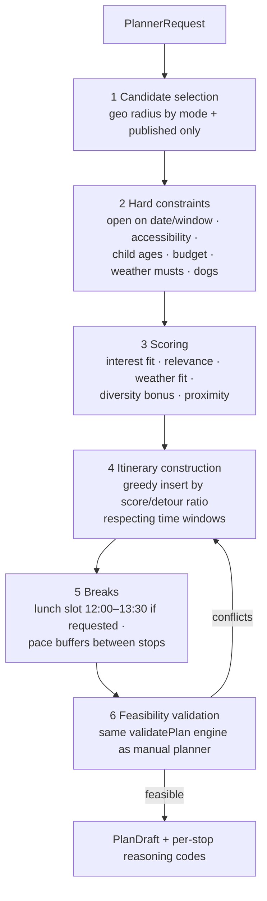

# Deterministic planner (phase 2)

Status: **planning-ready specification** — built only when Gate G1 is met ([../product/success-metrics.md](../product/success-metrics.md#g1--build-the-deterministic-automatic-planner-phase-2)); precedes any LLM planning ([ADR-007](../adr/ADR-007-deterministic-before-llm.md)).

## Purpose

Generate a **feasible** day itinerary from structured preferences using only verified data — explainable, testable, cheap. It also becomes the validation/repair engine the phase-3 AI assistant must pass through.

## Inputs

```ts
interface PlannerRequest {
  date: ISODate;
  window: { start: LocalTime; end: LocalTime };      // available time
  startPoint: { lat: number; lon: number; label?: string };
  endPoint?: { lat: number; lon: number };            // default: startPoint
  transportMode: 'walk' | 'bicycle' | 'public_transport' | 'car';
  groupType: 'family' | 'couple' | 'solo' | 'group';
  childAges?: number[];
  interests: InterestCode[];
  budget?: PriceLevel;                                // max per-adult level
  pace: 'relaxed' | 'moderate' | 'full';              // target stop count & buffers
  meals: { lunchBreak: boolean; preferCafeOnSite?: boolean };
  weather?: 'any' | 'rain_expected' | 'heat_expected'; // prefilled from forecast
  accessibility?: { wheelchair?: boolean; stroller?: boolean };
  mustInclude?: AttractionId[];                       // seeded from favorites
  avoid?: AttractionId[];
}
```

All vocabulary values reuse the filter taxonomy ([../data/tag-and-filter-taxonomy.md](../data/tag-and-filter-taxonomy.md)) — no planner-private enums.

## Pipeline (all deterministic, pure domain code)



1. **Candidate selection:** published attractions within a mode-dependent radius of the start point (walk 3 km · bike 12 km · PT 25 km with stop ≤500 m · car 40 km), capped ~200 by relevance.
2. **Hard constraints before preferences** (binding rule): closed on date/window ⇒ out; wheelchair/stroller required but not verified ⇒ out (must semantics); no suitable child age band ⇒ out; over budget ⇒ out; `rain_expected` ⇒ rainSuitability ≥ GOOD required for ≥ ⅔ of stops.
3. **Scoring (transparent weights, config not code):** `0.35 interestFit + 0.20 relevance (reuses public formula) + 0.15 weatherFit + 0.15 diversity (category spread penalty for monotony) + 0.15 proximityToRoute`.
4. **Construction:** greedy best-insertion by score-to-added-travel-time ratio into the time window; travel times from the `TravelTimeEstimator` interface (phase 2 upgrades it to real routing — [../architecture/external-services.md](../architecture/external-services.md#routing-phase-2-only)); pace sets target stops (relaxed 2–3, moderate 3–4, full 4–6) and inter-stop buffer (30/20/10 min). `mustInclude` items are inserted first regardless of score (but still subject to hard constraints — conflicts are reported, not silently dropped).
5. **Breaks:** lunch block when requested (prefer a stop with `foodOnSite`/`cafeOnSite` overlapping 12:00–13:30, else explicit free-time block); buffers per pace.
6. **Validation:** the manual planner's `validatePlan` must return zero error-level conflicts; residual warnings ship with the plan. Max 3 construction retries with relaxed *soft* choices (never relaxed hard constraints); if infeasible, return the best partial plan + machine-readable reasons ("only 2 attractions match all constraints on this date").

## Output {#api}

`POST /api/planner/generate` → `PlanDraft`:

```ts
interface PlanDraft {
  stops: { attractionId: string; arrival: LocalTime; departure: LocalTime;
           travelFromPrevious: { minutes: number; mode: string };
           reasoning: ReasonCode[] }[];   // e.g. INTEREST_MATCH_TECHNOLOGY, RAIN_SAFE, NEAR_ROUTE
  breaks: { start: LocalTime; end: LocalTime; kind: 'lunch' | 'buffer'; suggestion?: AttractionId }[];
  validation: PlanValidation;             // same type as manual planner
  feasibility: 'full' | 'partial' | 'infeasible';
  reasons?: MachineReadableReason[];
  alternatives?: { attractionId: string; wouldReplace: string; whenUseful: ReasonCode }[];
}
```

Only verified attraction IDs ever appear (the planner reads the same repository as the public API). Reason codes → localized explanations in the UI; the user lands in the **manual planner** for edits (single editing surface).

## Testing (feasibility suite — designed now, built in phase 2)

Golden tests per test persona ([../quality/testing-strategy.md](../quality/testing-strategy.md#test-personas)) on a fixture dataset: rainy family day in Konstanz · wheelchair couple Überlingen · budget solo PT-only from Bregenz · toddler half-day Radolfzell. Property tests: never schedules a closed stop; total time ≤ window; hard constraints unviolated for any random request; deterministic (same input ⇒ same output, seeded tie-breaking).
