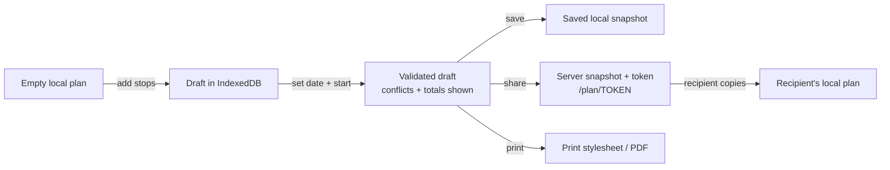

# Manual planner ("My Day")

Status: **confirmed requirements** (REQ-PLAN-01…11), **architectural decision** (validation engine shared client/server, duration heuristics).

The MVP planner is deliberately simple: users assemble the day themselves; the system contributes arithmetic and honesty (durations, conflicts) — no optimization, no automation (that is phase 2, [deterministic-planner.md](deterministic-planner.md)).

## Plan lifecycle



Storage: local-first (IndexedDB, same shape as server model); server persistence **only on share** ([../architecture/auth-and-anonymous-usage.md](../architecture/auth-and-anonymous-usage.md#anonymous-data-model)). Plan model: [../architecture/domain-model.md](../architecture/domain-model.md#plan--planstop-user-data-server-side-only-when-shared).

## Functional rules

| # | Rule |
|---|---|
| 1 | Add from list/map/detail/favorites; duplicate stop adds are no-ops with a hint (REQ-PLAN-01) |
| 2 | Max 20 stops (sanity + share-payload cap); realistic days have 2–6 |
| 3 | Reorder via drag (pointer) and ↑/↓ buttons (touch/keyboard/SR) (REQ-PLAN-03, [../quality/accessibility.md](../quality/accessibility.md)) |
| 4 | Optional intended date (REQ-PLAN-04); without a date, conflict detection uses "typical" hours and says so |
| 5 | Optional start point: current position / place search / accommodation label (REQ-PLAN-05); stored rounded ~100 m when shared |
| 6 | Per-stop planned visit duration defaults to attraction `typicalDurationMin..Max` midpoint, user-overridable in 15-min steps (REQ-PLAN-06) |
| 7 | Stops without date-relevant opening hours show "hours unknown" rather than fake confidence |

## Duration estimation {#duration-estimation}

Total plan duration = Σ visit durations + Σ travel estimates between consecutive points (start → stop 1 → … → stop N).

**MVP travel estimate = deliberate heuristic, no routing provider** ([../architecture/external-services.md](../architecture/external-services.md#routing-phase-2-only)):

```
travelMinutes = (greatCircleKm × detourFactor) / modeSpeedKmh × 60
detourFactor = 1.3 (roads aren't straight; ferries make this rough around the lake)
modeSpeed: walk 4.5 · bicycle 14 · car 45 · publicTransport 25 (incl. wait penalty +10 min)
```

Displayed as "~35 min by car" with an explicit approximation tilde; the UI copy states estimates are rough and ferries/traffic are not modelled. Mode = plan-level setting (default from last reachability filter, else car). Constants are config values; phase 2 replaces this function with real routing behind the same interface (`TravelTimeEstimator`).

## Conflict detection (REQ-PLAN-07)

Pure domain function `validatePlan(plan, attractions, date, holidayCalendars) → PlanValidation` in `packages/domain` — the **same code** runs client-side (instant feedback) and server-side (shared-plan rendering). Checks, in order along the computed timeline (day start defaults 09:00, adjustable):

| Conflict | Severity | Message pattern (DE/EN localized) |
|---|---|---|
| Stop closed on chosen date (rules or exceptional closure) | Error-level warning | "Closed on {date}" + next open day if computable |
| Arrival after closing − 30 min | Warning | "Closes {time}; you would arrive {time}" |
| Visit exceeds closing time | Info | "Not enough time for the typical visit before closing" |
| Hours unknown/stale | Info | "Opening hours unverified — check the official site" |
| Total exceeds available day (> 12 h span) | Warning | "This plan looks longer than a day" |

Conflicts **never block** saving or sharing (users may know better); they are honest annotations (REQ-PLAN-07 "detect obvious conflicts" — nothing more).

## Share, print, copy

- Share → `POST /api/plans` → immutable snapshot + ≥128-bit token ([../architecture/api-contracts.md](../architecture/api-contracts.md#plans), [../ux/favorites-and-plans.md](../ux/favorites-and-plans.md#shared-plans)).
- Shared view recomputes validation against **current** data — a plan shared in May shows October closures honestly.
- Print stylesheet spec: [../ux/favorites-and-plans.md](../ux/favorites-and-plans.md#print--export-req-plan-10).

## Edge cases

Attraction unpublished after adding → stop renders disabled with explanation, excluded from totals, removable. Date in past → soft warning. Offline → everything except share/geocode works ([../architecture/pwa-strategy.md](../architecture/pwa-strategy.md)). Locale switch → plan is locale-independent (IDs); labels re-render.

## Phase-2 compatibility (nothing more built now)

The deterministic planner emits the **same Plan shape** with `origin: GENERATED`; manual editing of generated plans reuses this entire feature unchanged. That is the only forward provision.
