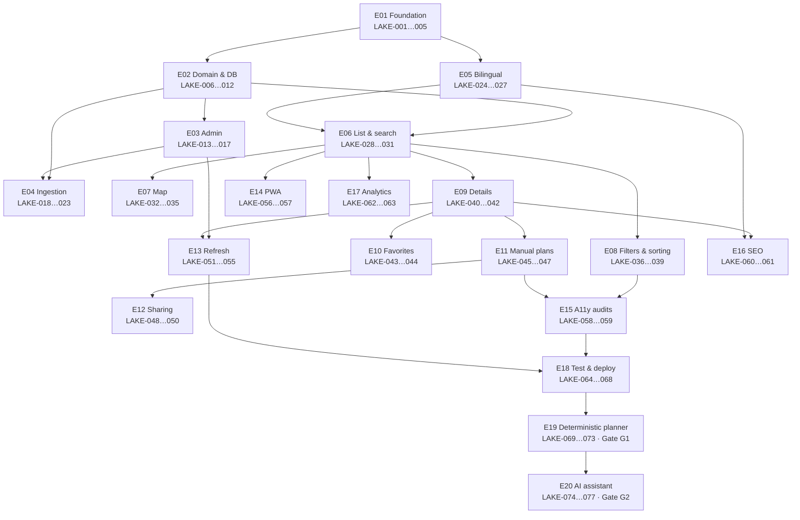

# Dependencies

Status: **architectural decision** (hard dependencies), **recommendation** (lane assignments). Per-ticket dependencies are listed in each ticket; this file shows the cross-epic graph.

## Epic dependency graph

## Hard sequential chains (must not be parallelized)

1. **LAKE-001 → 003 → 004** (scaffold → CI → local dev) → everything else.
2. **LAKE-006 → 007 → 008 → 009 → 010** (schema → geo → vocab → domain pkg → fixtures): the data foundation is one strict chain.
3. **LAKE-020 → 019 → 022 → 023** (research schema → import endpoint → import UI → pilot); pilot additionally needs LAKE-011 (dedup) and LAKE-016 (review queue).
4. **LAKE-024 → 005** (i18n routing before app shell) and **LAKE-024 → 025** (slugs).
5. **LAKE-012 → 038** (hours engine → open-now filter) and **LAKE-012 → 046** (→ plan validation).
6. **LAKE-045 → 046 → 047 → 048 → 049/050** (plan store → validator → screen → share → views).
7. **LAKE-051 → 052/053/054 → 055** (job framework → refreshers → staleness UI).
8. Launch gate: **LAKE-064…068 after** all MVP feature epics.

## Parallel work lanes {#parallel-work-lanes}

After M1 (foundation + content backbone), three lanes can run concurrently without merge conflicts by construction (different packages/routes):

| Lane | Epics/tickets | Touches |
|---|---|---|
| A — Discovery | E06 → E07/E08 → E09 | `apps/web` public routes, list/map/filter components, public API |
| B — Ingestion & admin | E04 (+E03 remainder) → E13 | `/admin`, import pipeline, jobs |
| C — Personal | E10 → E11 → E12 | favorites/plan components, plan API, IndexedDB layer |

Cross-lane contract: all three consume `packages/domain` + `packages/db` read-only; changes to shared packages go through lane-A-owner review (or a dedicated foundation owner) to prevent drift.

Safe-to-parallel tickets are marked `parallel: yes` in each ticket; tickets touching shared packages are marked `sequential (shared foundation)`.

## External dependencies (non-code)

| Dependency | Blocks | Mitigation |
|---|---|---|
| Hosting decision (LAKE-002) | Staging from M0 | Local + Docker keeps development unblocked |
| Tile/geocoder account + terms verification | LAKE-032, 031 | Fake adapters allow UI work first |
| Legal reviews (⚠️ items, [../quality/security-and-privacy.md](../quality/security-and-privacy.md#legal-review-checklist)) | Launch (LAKE-068), not development | Start early; track in risks R-04/R-05 |
| Research operation capacity | REQ-DATA-10 launch coverage | Pilot early (M3); scale in parallel; launch scope = checklist localities, not all 15 sectors fully researched |
| Domain name decision (OQ-1) | LAKE-060/061 finalization | Placeholder domain until then |
