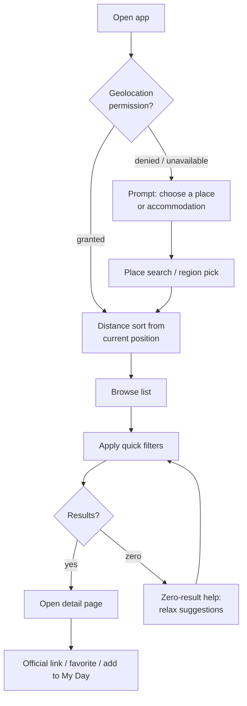
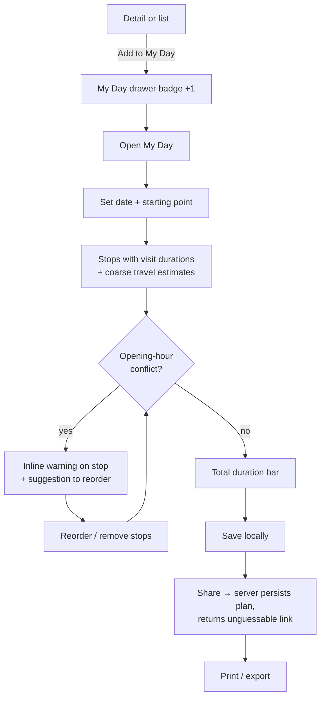

# Core user flows

Status: **recommendation**, derived from journeys in [../product/personas-and-user-journeys.md](../product/personas-and-user-journeys.md).

Every flow lists its UI states. Global rule: **no dead ends** — every empty/error state offers a next action.

## F1: Discover nearby

- Geolocation is requested **only after a user gesture** ("Sort by distance from me"), never on load (REQ-SEC-01; [../quality/security-and-privacy.md](../quality/security-and-privacy.md#location-data)).
- Fallback location: last used place (stored locally) → manual pick. Position is never sent to the server in raw form; distance filtering uses rounded coordinates (~100 m grid) in API calls.
- States: skeleton list (loading) · zero-result helper (empty; see [filter-and-search-behaviour.md](filter-and-search-behaviour.md#zero-results)) · offline banner + cached content (error) · stale badge on volatile facts (stale).

## F2: Rainy day

Quick-filter chip "Rainy day ☔" = `rainSuitability in (GOOD, EXCELLENT) AND openState = OPEN_NOW`, distance sort. One tap from Discover. Same states as F1.

## F3: Plan a day

- Conflict semantics and duration estimation: [../planning/manual-planner.md](../planning/manual-planner.md).
- States: plan empty (educational empty state with "find attractions" CTA) · conflict (warning, non-blocking) · share failure (retry, plan stays local) · date in past (soft warning).

## F4: Open a shared plan

1. Recipient opens `/{locale}/plan/{token}` — read-only view, no account, locale switchable.
2. Sees stops, date, map overview, conflicts recomputed against **current** data (plans don't freeze facts).
3. CTA "Copy to My Day" clones stops into the local plan.
4. Invalid/expired token → friendly 404 with Discover CTA. Token properties: [../architecture/auth-and-anonymous-usage.md](../architecture/auth-and-anonymous-usage.md#share-tokens).

## F5: Language switch

Language toggle in header/More tab. Switch preserves the current page and filter state (`/de/orte/insel-mainau` ↔ `/en/places/mainau-island`). First visit: locale negotiated from `Accept-Language`, overridable, persisted locally (REQ-I18N-01).

## F6: Report incorrect information

Detail page → "Report an issue" → category (closed/hours wrong/price wrong/accessibility wrong/other) + optional free text (no personal data requested) → rate-limited anonymous POST → lands in the review queue ([../data/refresh-and-review-pipeline.md](../data/refresh-and-review-pipeline.md#user-reports)) (REQ-REP-01, REQ-SEC-02).

## F7: Editor reviews a change proposal (admin)

1. Editor signs in to `/admin` ([../architecture/auth-and-anonymous-usage.md](../architecture/auth-and-anonymous-usage.md#admin-authentication)).
2. Review queue shows change proposals: field, old → new value, source, confidence, diff.
3. Editor approves (fact updated + provenance stamped), rejects (status recorded), or edits manually.
4. Approval of a translation-relevant field flags the counterpart locale for re-translation ([../architecture/i18n.md](../architecture/i18n.md#translation-invalidation)).

## F8: Install PWA

Browser install prompt is *not* intercepted on first visit; a subtle "Install" hint appears in More after the second session ([../architecture/pwa-strategy.md](../architecture/pwa-strategy.md)).
